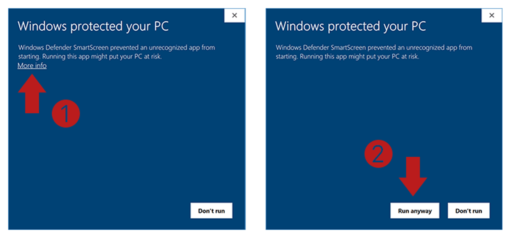

  

# WarrantFlow

**A free, portable, encrypted California search warrant generator.**

WarrantFlow is a single-file Windows app for patrol officers in the field.
Run it from a USB stick or any folder on the patrol-car tablet — no install,
no admin rights, no registry writes. Fill in a warrant, generate a Word or
PDF document, and have it ready for the magistrate.

> WarrantFlow is an independent project. It is not affiliated with, approved by,
> or endorsed by any law enforcement agency, court, or government body. Before
> installing or running it on any computer you do not personally own, get
> explicit permission from the owner or your agency's IT department.

---

## Download

> **Get the latest version from the [Releases page](https://github.com/BeckerIndustries/WarrantFlow/releases/latest).**

Download `WarrantFlow.exe` from the most recent release. That single file
is the entire program (~86 MB, includes the .NET runtime — works on any
modern Windows 10/11 machine).

## Quick start

Tutorial Video https://youtu.be/SoRYK0B8CkI

1. Put `WarrantFlow.exe` anywhere — USB stick, Desktop, Documents folder.
2. Double-click it.
3. Accept the disclaimer, set a master password, fill in your profile,
   and start drafting.

On first launch the app creates everything it needs next to itself
(`templates\`, `data\`) and extracts starter search-warrant and
warrant-return Word templates into `templates\`. Open either file in
Word any time to customize the wording or layout for your agency —
your edits are preserved on every future launch.

In-app **About** and **View Disclaimer** dialogs cover the day-to-day
guidance you'd want. The full docs and updates live here on GitHub.

### "Windows protected your PC" warning on first launch?

  

The first time you double-click `WarrantFlow.exe`, Windows may show a
blue **Microsoft Defender SmartScreen** dialog that says *"Windows
protected your PC — Microsoft Defender SmartScreen prevented an
unrecognized app from starting"*.

This is **expected and not a sign of anything wrong with WarrantFlow.**
SmartScreen flags any Windows program it hasn't seen many times before,
regardless of what's inside. To get past it:

1. Click **More info** (small text under the message).
2. Click the **Run anyway** button that appears.

Windows remembers your choice for that file, so you'll only see this on
the very first launch. If you ever download a newer version, you'll see
it once more on that new copy too.

**Alternative — unblock the file before running it:**

1. Right-click `WarrantFlow.exe` → **Properties**.
2. At the bottom of the General tab, check the **Unblock** box next to
   "This file came from another computer…".
3. Click **OK** and double-click the .exe normally.

Both methods are equivalent — pick whichever is easier in your setup.

> Some agency IT environments block "Run anyway" by group policy. If you
> see the SmartScreen dialog with no Run anyway option, ask your IT team
> to whitelist `WarrantFlow.exe`, or to allow you to run the file from
> your USB stick / approved storage location.

## Features

- **Search warrants** — guided form covering CA Penal Code 1524 statutory
  grounds (all 22), places to search, items to seize, probable cause,
  special court orders, and judge / date / time of issuance.
- **California statutes picker** — built-in catalog of common Penal,
  Vehicle, Health & Safety, BPC, and Welfare & Institutions codes. Search,
  click, append. Catalog ships embedded so it works offline; refreshes
  from this repo when online.
- **Warrant returns** — focused, short form with just the fields that
  vary per return. Executor name + rank prefilled from your profile.
- **Encrypted vault** — every saved warrant, your profile, and any
  captured signature live inside an AES-256-GCM file unlocked by your
  master password. Wrong passwords don't reveal anything; three failures
  in a session locks the app.
- **Signature capture** — draw your signature once with the mouse or a
  touchscreen; it embeds on every generated document.
- **Snippet library** — reusable clauses (Google account language, Apple
  iCloud language, cellphone language, etc.) you can paste into a warrant
  in one click. Catalog updated through this repo.
- **Bookmarks page** — shared links to court forms, DMV lookups, agency
  intranets. Mark agency-network-only links so they're visible but flagged.
- **Dark / light mode**, **auto-logout**, **encrypted backups**, **printable
  preview**, **inline disclaimer** that meets you on every launch.

## Privacy and data ownership

- **Everything stays on your device.** No cloud sync, no telemetry, no
  phone-home. The only network calls are catalog refreshes from this
  public GitHub repo, and only when triggered by you.
- **No password recovery.** Your data is unreadable without your master
  password. Choose one you can remember.
- **You own the documents you generate.** The app fills templates with
  what you type — it does not verify legal sufficiency. Review every
  generated document before signing or filing.

## Disclaimer

WarrantFlow is provided **as-is, without warranty of any kind**. It does
not verify legal sufficiency or statutory accuracy. Officers using the
program are responsible for reviewing every document before signing or
filing it, complying with California Penal Code section 1524, evidence
rules, agency policy, and court procedure. The full disclaimer is shown
on first launch and is also available in the app under About → View
Disclaimer.

## Donations

WarrantFlow is **free**. If it saved you time and you want to support
development, the donation link lives in the app under About → Buy Me a Coffee.

## For contributors

This repository also hosts the public catalogs the app downloads, all
under [`catalogs/`](catalogs/):

- `catalogs/catalog.json` — language-library snippets
- `catalogs/bookmarks.json` — shared bookmarks
- `catalogs/california_statutes.json` — California statute catalog
- `catalogs/home.json` — home-dashboard banner + supporter shoutouts

See [`docs/CATALOGS.md`](docs/CATALOGS.md) for schemas and the workflow
for adding or updating entries.
